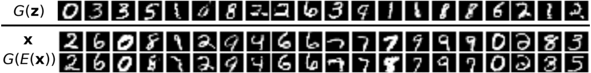

# EVALUATING BiGAN MODEL ON THE MNIST DATASET

Just copy this repository to [G-Drive](https://drive.google.com/drive/my-drive) and run the notebooks using [Colaboratory](https://colab.research.google.com/).

[Results](report.pdf) (written report)

